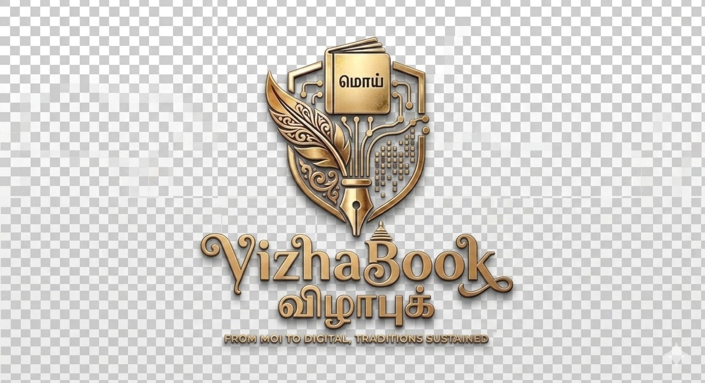

<p align="center">
  
</p>

# 🪔 Vizha Book — விழா புக்

<p align="center">
  
  
  
  
  
</p>

---

## ✨ The Digital Moi Ledger

**Vizha Book** is a premium, bilingual web application that digitalizes the age-old South Indian tradition of **Moi** — recording cash gifts and presents at family functions such as Weddings, Engagements, and House Warmings.

It replaces the traditional handwritten notebook with a stunning, all-digital interface that your family will love.

> [!IMPORTANT]
> **Fully Offline-First**
> Vizha Book stores all data in your browser's `localStorage`. No server, no login, no cloud. All data is private and fully accessible without internet.

---

## 🚀 Core Features

- **⚡ Rapid Moi Entry** — Record a guest's gift in seconds. Just type their name, amount, and press submit. Guests are auto-created in real time.
- **💐 Greeting Card Generator** — Every Moi entry instantly produces a premium, printable Thank-You card ready for WhatsApp sharing.
- **📱 WhatsApp & SMS Auto-Send** — One tap sends the pre-filled, personalized greeting directly to the guest's number with proper Indian country-code formatting.
- **📊 Smart Ledger** — View all entries in a beautiful table with multi-filter support (by name, function) and a live **Total Amount** footer.
- **🎊 Function Management** — Manage multiple events (e.g., *Suresh & Preeti Wedding*, *Karthik's Reception*) simultaneously.
- **🌐 Bilingual (EN / தமிழ்)** — Fully togglable between English and Tamil for accessibility among all family members.
- **🌙 Dark Mode** — Elegant light and dark themes for any environment.
- **📱 Mobile Responsive** — Animated Framer Motion hamburger menu ensures a premium experience on all screen sizes.

---

## 🛠️ Tech Stack

| Component | Technology | Role |
| :--- | :--- | :--- |
| **Framework** | React (Vite) | App Shell & Reactivity |
| **Routing** | React Router DOM | Page Navigation |
| **UI Animations** | Framer Motion | 3D Tilt, Spring Menus, Transitions |
| **Icons** | Lucide React | Crisp Icon System |
| **Styling** | Vanilla CSS | Custom Design System, CSS Variables |
| **Charts** | Recharts | Dashboard Collection Trend |
| **Confetti** | canvas-confetti | Entry Success Celebration |
| **Export** | XLSX | Excel Export from Ledger |

---

## ⚡ Quick Start

1. **Install Dependencies**
   ```bash
   npm install
   ```
2. **Launch Dev Server**
   ```bash
   npm run dev
   ```
3. Open your browser at `http://localhost:8080` (or the URL Vite provides).

---

## 📂 App Pages

| Route | Page | Description |
| :--- | :--- | :--- |
| `/` | **Dashboard** | Key metrics, trend chart, recent entries |
| `/functions` | **Functions** | Create & manage your family events |
| `/entry` | **Moi Entry** | Core form — record gifts, generate card |
| `/ledger` | **Ledger** | Full history with filters and totals |

---

## 🎨 Design Highlights

- **Classic Midnight Sapphire UI** — Deep navy and sapphire gradients on a clean Slate background with brilliant Gold accents.
- **3D Interactive Cards** — Cards physically tilt toward your mouse using Framer Motion's `useMotionValue` + `perspective: 1000px`.
- **Glassmorphism** — Frosted-glass overlays with `backdrop-filter: blur()` layered throughout the interface.
- **Layered 3D Shadows** — Multi-layer CSS drop-shadows (`--shadow-3d`) simulate physical depth.

---

## 👤 Credits

Developed with passion by **ManojRaj**.

<p align="center">
  <a href="https://github.com/manojrajm">
    
  </a>
  <a href="mailto:gauthamtamizha007@gmail.com">
    
  </a>
</p>

---
<p align="center">
  <i>"Building the future, one pixel at a time."</i>
</p>
